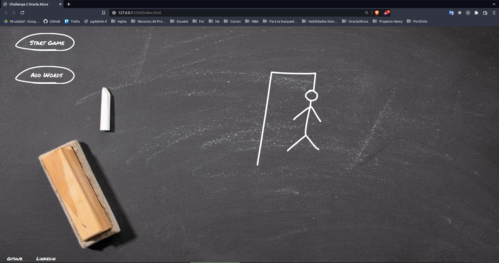
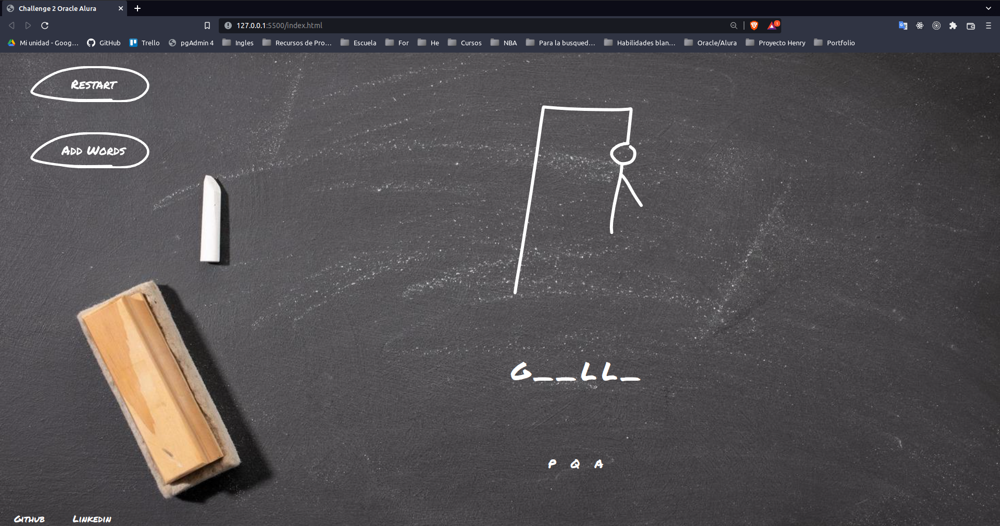
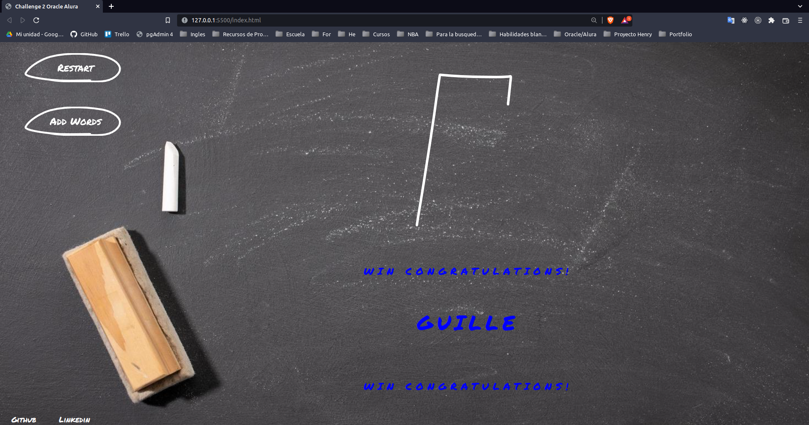
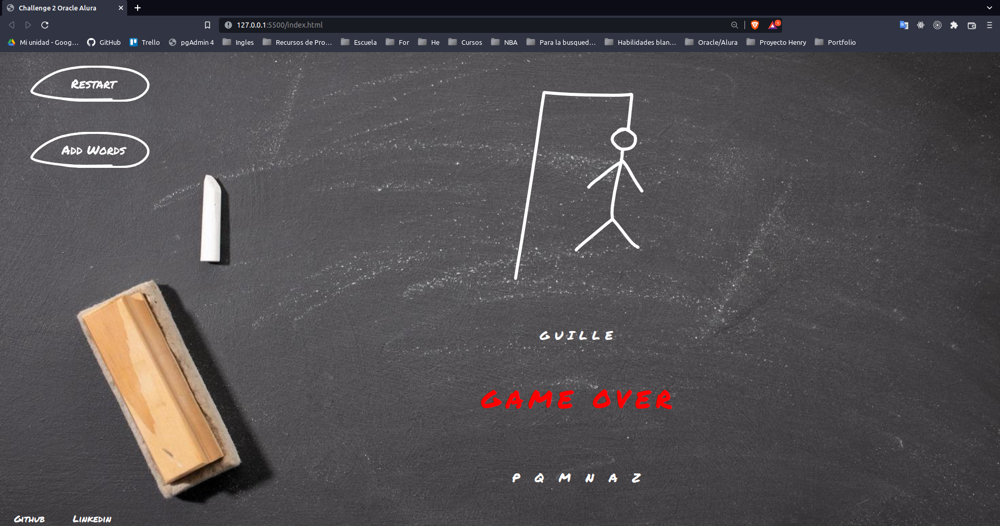
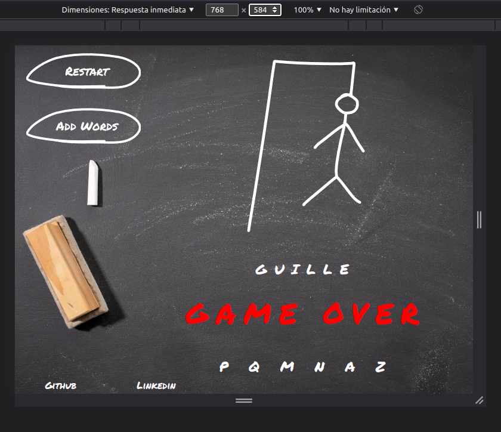
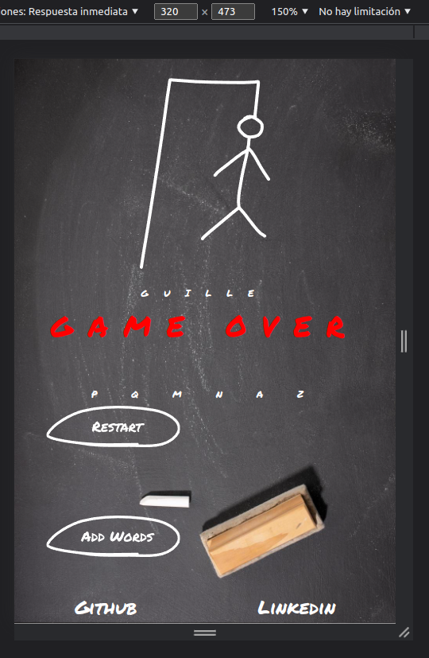

# **[Challenge-oracle-two](https://angelguillermomontania.github.io/challenge2-OracleAlura.github.io/)**

## **Recommendation:** 
Run **Live Server** or similar in the corresponding html

### **Hangman game**

**Requirements:**
- When completing or drawing the gallows, a "Game Over" message should be displayed on the screen.
- If the correct word is completed before the guesses run out, a "You won, Congratulations!" message should be displayed. on the screen.
- The page must have hyphens indicating each letter of the word, separated by a space
- It should not be possible to write numbers in the game
- The wrong letters must appear on the screen, but they cannot appear repeatedly
- The correct letters should appear on the screen above the hyphens, in the correct position in relation to the word.

**Additional features:**
- Accepts letter Ñ or ñ
- You can add the word in lowercase or uppercase
- The drawing of the hanged man is animated with animejs for a more interactive and enjoyable game
- 

## **Images**

**Desktop**
   

 
 

**Tablet**

 
 

**Mobile**

 
 
 
 

### [Figma](./extra/Figma/Design.pdf)